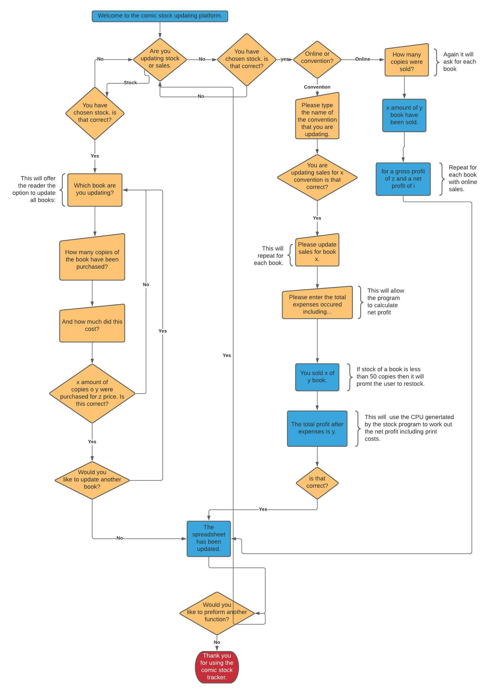

# **Comic Sales tracker**

This project is the third milestone project for the Code Institute Diploma in Full Stack Software Development. You can see the final deployed site [here.](link)

<!--  -->

## **Contents**
* [UX](#ux)
    * [User Stories](#user-stories)
    * [Flow Chart](#flowchart)
* [Features](#features) 
    * [Welcome Screen](#welcome-screen)
    * [Update Stock](#update-stock)
    * [Update Sales](#update-sales)
    * [Con Sales](#con-sales)
    * [Online Sales](#online-sales)
    * [Update Spreadsheets](#update-spreadsheets)
    * [Confirm Data](#confirm-data)
    * [Rerun Application](#rerun-application)
    * [Update Cost Per Unit](#Update-cost-per-unit)
    * [Add New Book](#add-new-book)
    * [Con Profits](#con-profits)
    * [Low Stock Warning](#low-stock-warning)
    * [Data Validation](#data-validation)
    * [Set up](#set-up)
* [Features left to implement](features-left-to-implement)
    * [Automatic Reordering](#automatic-reordering)
* [Technologies Used](technologies-used)

## **UX** 

### **User stories**

The application is designed to be a stock management system for comic creators. 

#### As a user, I expect:
* To be able to easily understand what information the application is asking for. 
* To be prompted to reorder stock when an item is running low. 
* To get reports after each input showing both gross and net profit in an easy to understand manner. 
* To be able to easily update sales.
* To be able to easily update stock. 
 
#### As a user, I want:
* To be able to see the data I am to input to confirm it is correct. 
* To be able to easily navigate through the data. 
* To be able to add additional books directly to the command line without having to manually modify the code or the spreadsheet. 

### **Flow Chart**
Before starting on the project, I created a mock up using lucid chart to break down the logic I would need to follow to ensure that the application worked correctly.  

## **Features**

### **Welcome Screen**
 * The application displays a welcome message on first launch. This would clearly layout the purpose of the application. This should be followed with the choice to update stock or to update sales. 

### **Update Stock**
 * The application should give the user the option to update stock of individual books. This should be easy to update while getting all the information needed to maintain the sales data base including: 
    * Number of items ordered.
    * Cost of the order
    * Date of the order

### **Update Sales**
 * The application should prompt to see if the user is update sales from a convention or from the online store. 

### **Con Sales**
 * When updating con sales the program prompts the user following information: 
	* The name of the convention. 
	* The date of the convention. 
	* The sales of each book. 
	* The expenses incurred during the convention (broken down into table costs, travel costs, parking, and miscellaneous costs.

### **Online Sales**
* When updating online sales the program prompts the user following information: 
	* The date of the sales. 
	* The sales of each book. 

### **Update Spreadsheets**
 * The application pushes all information to a linked google sheets doc for easy viewing. 

 ### **Confirm Data**
* After each input the application repeats the information back to the user and ask them to confirm before it pushes the data to the spreadsheet. 

 ### **Rerun Application**
 * Once the application has finished running it gives the user the option to rerun to add any additional sales/ stock that’s required.   

### **Update Cost Per Unit**
 * When an order is restocked it should automatically recalculate the cost per unit based on total cost of all items. This should also recalculate all previous sales to reflect the new CPU.

 ### **Add New Book**
 * The application will give the user the option to add a new product when ordering new stock. This will automatically update all other functions to prompt for data for this product when carrying out functions. 

### **Con Profits**
 * The application uses this information (and the CPU generated from the stock function) to work out both the net and gross profit from the convention sales.  

### **Low Stock Warning**
 * The application will prompt the user when stocks of an item are running low.

### **Data Validation**
 * The application validates all information to ensure that the correct data is being passed to it. If incorrect data is passed to it will tell the user what the issue is and how they can resolve it. 

 ### **Set Up**
 * If there are no books inputed in the spreadsheet the program will run a set up function prompting the user to add their comics to the program. 

 ## **Features left to implement**

### **Automatic Reordering** 
* The application should offer the user the option to automatically send an email to the printer to order a restock of a book. This email should include:
	* The restock amount. 
	* The date of the last reprint. 

## **Technologies Used**

* Python
* Git
* Google Docs
* Google Sheets

