# **Comic Sales tracker**

This project is the third milestone project for the Code Institute Diploma in Full Stack Software Development. You can see the final deployed site [here.](https://comic-stock-tracker.herokuapp.com/)

The app is a stock tracker for comic creators that updates a [googlesheet](https://docs.google.com/spreadsheets/d/1rINav1mYdCZ2yVeBe1SFQGd25lQRAO4ZD53dSbDz-c0/edit#gid=1975812065) with upto date sales infomation. 

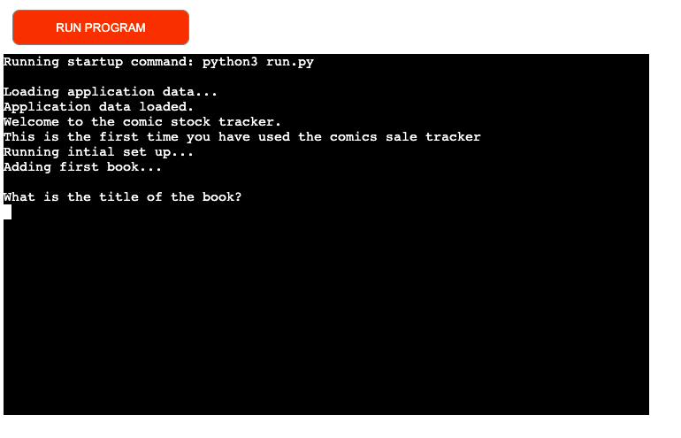

## **Contents**
* [UX](#ux)
    * [User Stories](#user-stories)
    * [Flow Chart](#flowchart)
* [Features](#features) 
    * [Welcome Screen](#welcome-screen)
    * [Update Stock](#update-stock)
    * [Update Sales](#update-sales)
    * [Con Sales](#con-sales)
    * [Online Sales](#online-sales)
    * [Update Spreadsheets](#update-spreadsheets)
    * [Confirm Data](#confirm-data)
    * [Rerun Application](#rerun-application)
    * [Update Cost Per Unit](#Update-cost-per-unit)
    * [Add New Book](#add-new-book)
    * [Con Profits](#con-profits)
    * [Low Stock Warning](#low-stock-warning)
    * [Data Validation](#data-validation)
    * [Set up](#set-up)
* [Features left to implement](features-left-to-implement)
    * [Automatic Reordering](#automatic-reordering)
* [Testing](#testing)
* [Technologies Used](technologies-used)
    * [Languages](#languages)
    * [Version Control](#version-control)
    * [Python Packages](#python-packages)
    * [Other Software](#other-software)
* [Deployment](#deployment)
* [Credits](#credits)
    * [Content](#content)
    * [Acknowledgements](#acknowledgements)

## **UX** 

### **User stories**

The application is designed to be a stock management system for comic creators. 

#### As a user, I expect:
* To be able to easily understand what information the application is asking for. 
* To be prompted to reorder stock when an item is running low. 
* To get reports after each input showing both gross and net profit in an easy to understand manner. 
* To be able to easily update sales.
* To be able to easily update stock. 
 
#### As a user, I want:
* To be able to see the data I am to input to confirm it is correct. 
* To be able to easily navigate through the data. 
* To be able to add additional books directly to the command line without having to manually modify the code or the spreadsheet. 

### **Flow Chart**
Before starting on the project, I created a mock up using lucid chart to break down the logic I would need to follow to ensure that the application worked correctly.  

## **Features**

### **Welcome Screen**
 * The application displays a welcome message on first launch. This would clearly layout the purpose of the application. This should be followed with the choice to update stock or to update sales. 

### **Update Stock**
 * The application should give the user the option to update stock of individual books. This should be easy to update while getting all the information needed to maintain the sales data base including: 
    * Number of items ordered.
    * Cost of the order
    * Date of the order

### **Update Sales**
 * The application should prompt to see if the user is update sales from a convention or from the online store. 

### **Con Sales**
 * When updating con sales the program prompts the user following information: 
	* The name of the convention. 
	* The date of the convention. 
	* The sales of each book. 
	* The expenses incurred during the convention (broken down into table costs, travel costs, parking, and miscellaneous costs.

### **Online Sales**
* When updating online sales the program prompts the user following information: 
	* The date of the sales. 
	* The sales of each book. 

### **Update Spreadsheets**
 * The application pushes all information to a linked google sheets doc for easy viewing. 

 ### **Confirm Data**
* After each input the application repeats the information back to the user and ask them to confirm before it pushes the data to the spreadsheet. 

 ### **Rerun Application**
 * Once the application has finished running it gives the user the option to rerun to add any additional sales/ stock that’s required.   

### **Update Cost Per Unit**
 * When an order is restocked it should automatically recalculate the cost per unit based on total cost of all items. This should also recalculate all previous sales to reflect the new CPU.

 ### **Add New Book**
 * The application will give the user the option to add a new product when ordering new stock. This will automatically update all other functions to prompt for data for this product when carrying out functions. 

### **Con Profits**
 * The application uses this information (and the CPU generated from the stock function) to work out both the net and gross profit from the convention sales.  

### **Low Stock Warning**
 * The application will prompt the user when stocks of an item are running low.

### **Data Validation**
 * The application validates all information to ensure that the correct data is being passed to it. If incorrect data is passed to it will tell the user what the issue is and how they can resolve it. 

 ### **Set Up**
 * If there are no books inputed in the spreadsheet the program will run a set up function prompting the user to add their comics to the program. 

 ### **Delete data*** 
 * The application has the option to clear all user inputs to help with testing or to allow the user to start again with a blank spreadsheet. 
 * The delete function is hidden from the user to reduce the chance that they would accidentally run it and lose all their data. 
 * To access the delete function the user types "delete" when prompted to choose between updating stock and sales. As this is irreversable it will warn the user that deleting the data will be permanent and will ask for confirmation three times before clearing the data. 

 ## **Features left to implement**

### **Automatic Reordering** 
* The application should offer the user the option to automatically send an email to the printer to order a restock of a book. This email should include:
	* The restock amount. 
	* The date of the last reprint. 

## **Testing**

[Link to External testing document](./TESTING.md)

## **Technologies Used**

### **Languages** 
* Python

### **Version Control** 
* Git

### **Languages** 
* Gspread
* datetime

### **Other Software** 
* Google Docs
* Google Sheets

## **Deployment**

The site is deployed via Heroku. To deploy the site please follow the following steps:

1. Go to the [Heroku website](https://heroku.com/) and log in to your account. If you have not made one yet first create an account.

2. On the home page click the new button and then click create new app. 

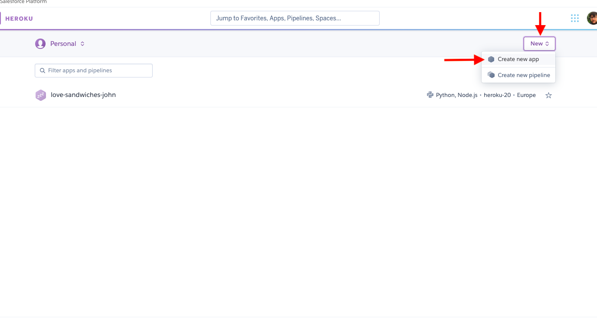 

3. On the next page enter a name for the app. This has to be unnique. You cannot use the same name as I have. Then enter your location before clicking create app. 

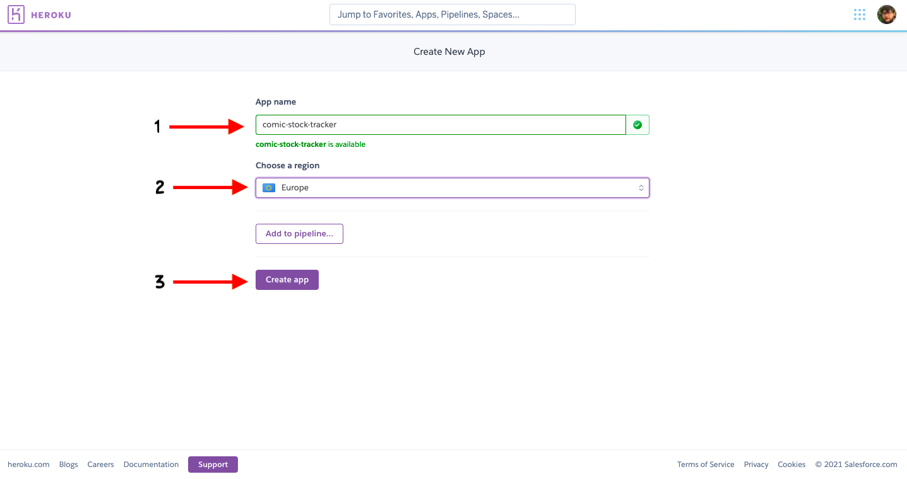 

4. Click on the settings tab. 

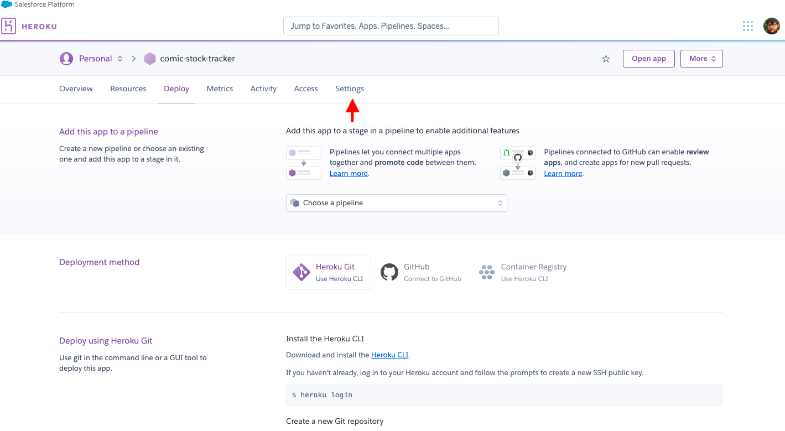 

5. Click on reveal config vars. 

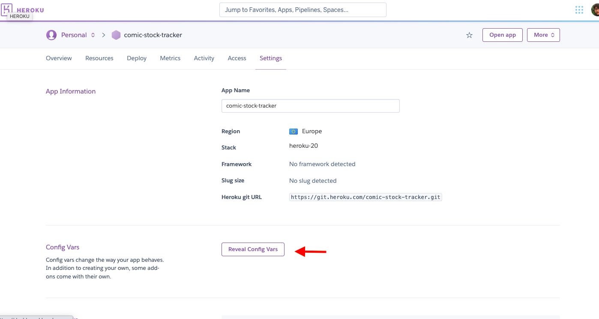 

6. In the key field type PORT and in the value field type 8000. Then click add. 

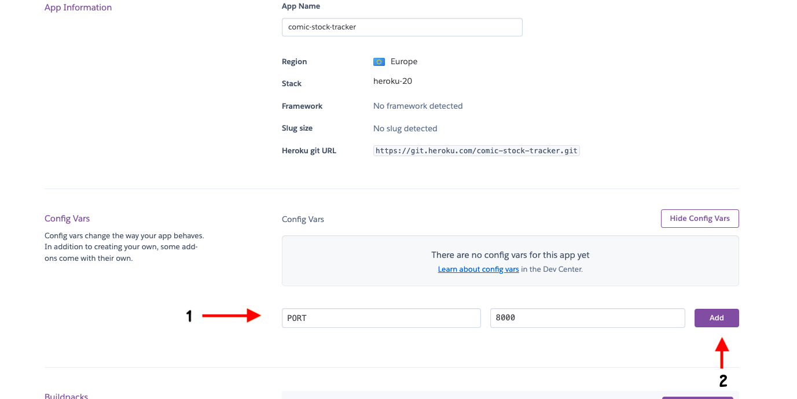 

7. In the key field type CREDS and in the value field copy and paste the data from your creds.json file. 

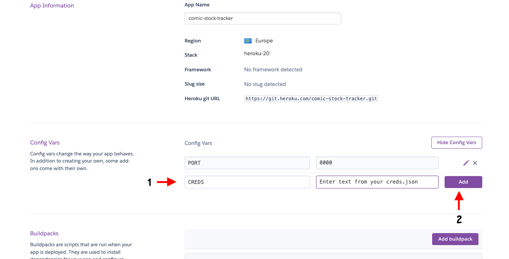 

8. Click add build pack. 

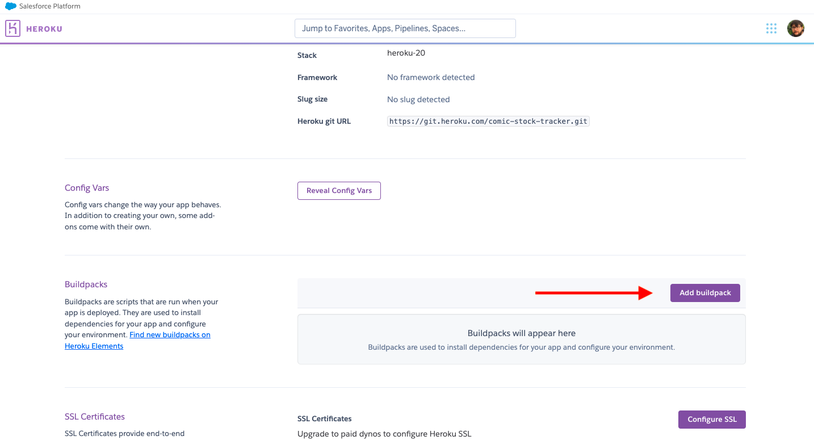 

9. Select Python and then click save changes. 

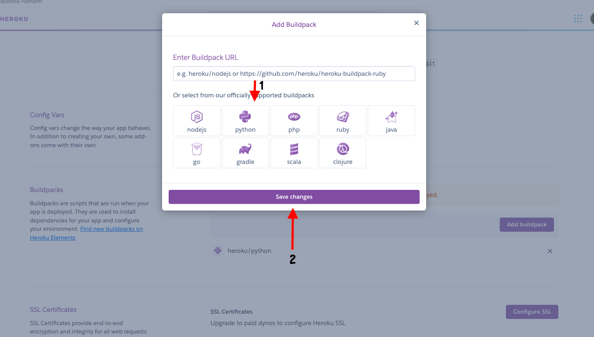 

10. Click add build pack again. Then select Node.js and click save changes. 

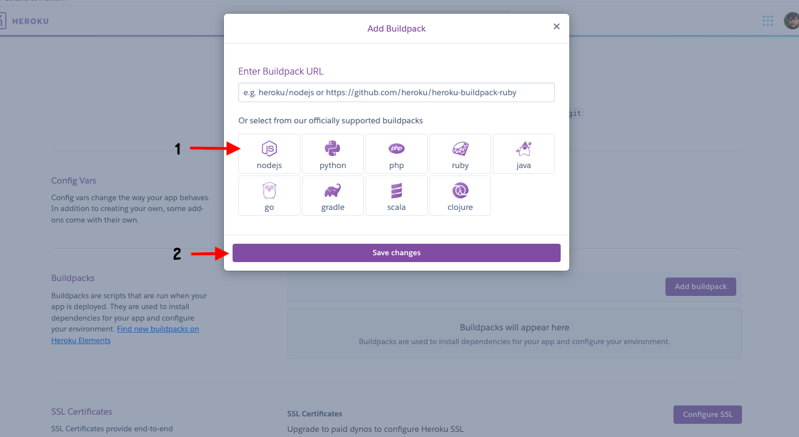 

11. Make sure that python is at the top of the list. If Node.js is at the top drag and drop to reorder. 

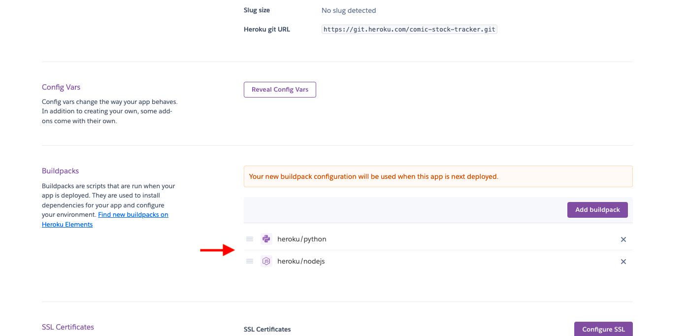 

12. Click on the deploy tab. 

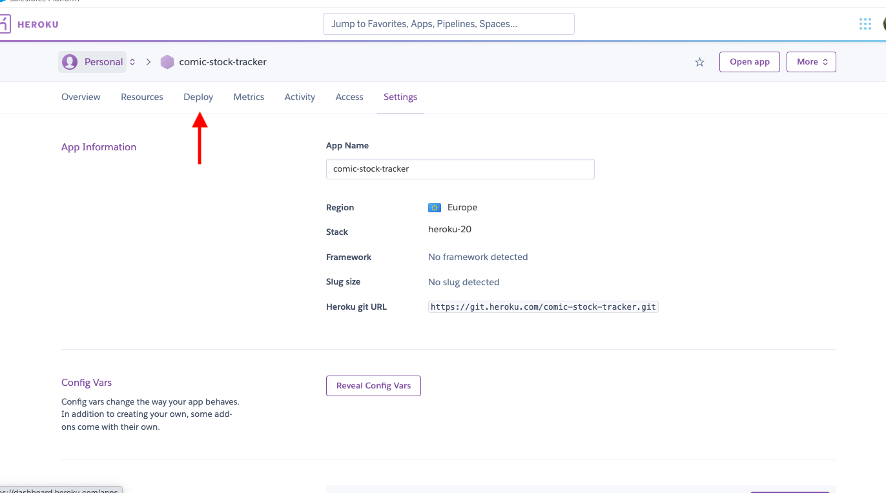 

13. Select Github in the deployment method section and enter the name of the repo in the search bar. Click search and then click connect. 

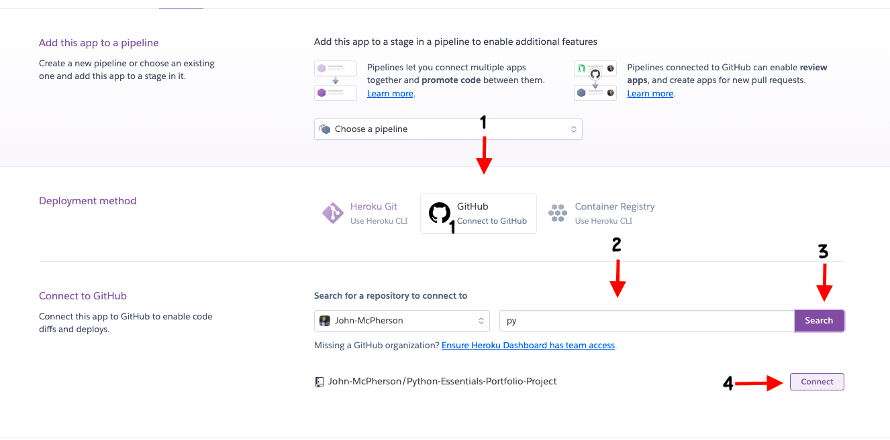 
14. Scroll down to Automatic deploys section and click on enable automatic deployment. 

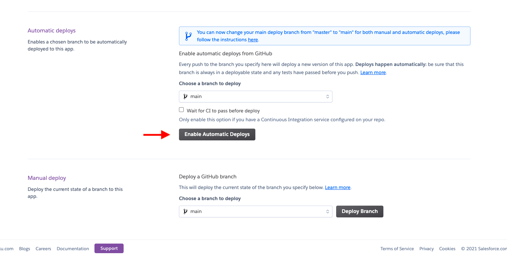 

15. Scroll up and click on open app. It may take sometime for the deployment to be completed. 

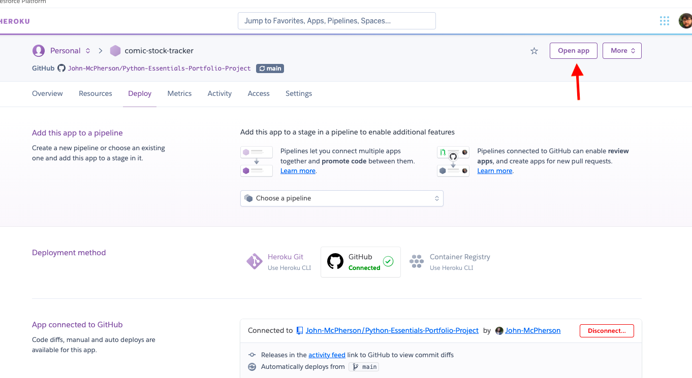 

## **Credits**

### **Content**

All code was written by me with the following exceptions; 

* The code for importing Gspread and setting the SCOPE was adapted from the Code Institute Love Running Code Along project.
* The code for the update_sheet function was taken from the Code Institute Love Running Code Along project.

### **Acknowledgements** 

* My mentor [Antonija Simic](https://github.com/tonkec) for their feedback and support during the development of the project. 
* [Code Institute](https://codeinstitute.net/) for giving me the skills through their tutorials to create this app. 
* [W3Schools](https://www.w3schools.com/) for helping me whenever I got stuck.

