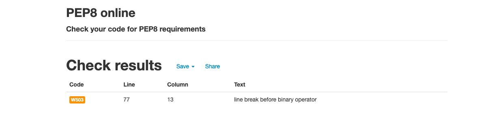

# **Testing** 

### **Note When Testing**
To test all functions you may need to delete the data in the google sheet. To do this when the program prompts you to choose between stock or sales type "delete" all in lower case. 

It will then ask you to confirm your choice three times. Then it will clear the sheet. If it has been preformed correctly it will look like this;

* [Validation](#Validation)
* [Functionality Testing](#functionality-testing)
    * [User Story Evaluation](#user-story-valuation)

## **Validation**
I ran my code through the [pep8online linter](http://pep8online.com/) to check for errors. The original code came back with the following errors;

These were fixed in commit [1ef6d64](https://github.com/John-McPherson/Python-Essentials-Portfolio-Project/commit/1ef6d6481bbeb06daed090ac80b0ed134fbbc72d#diff-d6af0459a37d985953d7040c14f53feb3b9cc9e58b543aa3c2b80256d276c5e0). After that the code passed through the linter with no further issues;

## **Functionality Testing**
* [User Story Evaluation](#user-story-valuation)
* [Additional User Stories](#additional-user-stories)
* [Manual Testing](#manual-testing)

### **User Story Evaluation**

Once development was complete I reevaluated my user stories to ensure that I had met the project goals; 

#### As a user, I expect:
* To be able to easily understand what information the application is asking for. 

**The application uses simple language when asking for user input. And when a speficic format is required (for example when inputting dates) that is indicated through a print statment**

**The application also uses data validation to ensure that the inputs are correct and uses error handling to help the user to know how to resolve any input errors**
* To be prompted to reorder stock when an item is running low.

**After updating sales the application checks to see if the stock levels for each book are less than 50 books. If they are it will prompt the user to place a reorder for the book**

* To get reports after each input showing both gross and net profit in an easy to understand manner. 

**After updating sales the infomation is presented to the user in an easy to understand format. This is then saved in the google sheet so that users can refer back to it.**

* To be able to easily update sales.

**On running the application the user is asked if they are asked if they are updating stock or sales. If they choose sales the program prompts them for the infomation required.**

* To be able to easily update stock. 

**On running the application the user is asked if they are asked if they are updating stock or sales. If they choose stock the program prompts them for the infomation required.**
 
#### As a user, I want:
* To be able to see the data I am to input to confirm it is correct.
**When updating a sale the program shows the user their input and asks them to comfirm it is correct before procedding.**

* To be able to easily navigate through the data.

**The application updates a google sheet that presents the data in an easy to understand way. Summaries for sales and stock are easily accesable. And there is a further break down for convention sales**

**Each book has it's own section which will display a more detailed breakdown of infomation.** 

* To be able to add additional books through the command line interface without having to manually modify the code or the spreadsheet.

**The stock update program has the option to add books to the spreadsheet. This function gets all the infomation required to run the program without requiring the user to have to update any spreadsheets manually** 

### **Additional User Stories**

During development it became clear that from a UX pov that I needed to add the following user stories; 

#### As a user, I expect:

* To be able to clear the google sheet from within the application. 

**While testing the application it quickly became irritating to have to manually delete the data everytime a new feature was added. To avoid this I implemented a function to clear the sheet and start again.**

**To avoid this being accidently being called I made it a hidden function and made it so that the user would have to confirm that they wanted to delete the data three times before deleting the data**

**To access the function when the program asks the user to choose between stock or sales you type "delete" in lowercase.**

* If the program is run without any data it will run a set up function to ensure that all the functions run correctly. 

**After excuting the delete function the next time the program runs it will run a set up function. This prevents the user from updating sales when there is nothing to update.**

### **Manual Testing**

After running the program through the linter I manually checked to ensure that all functions and validation was working as intended. 

My intial run through revealed that the delete function was not adding the correct headings in the con sheet which was making the data difficult to parse. This was fixed in commit [0d61bf](https://github.com/John-McPherson/Python-Essentials-Portfolio-Project/commit/0d61bf9df038751700188dcce306495a8d868886#diff-d6af0459a37d985953d7040c14f53feb3b9cc9e58b543aa3c2b80256d276c5e0).

