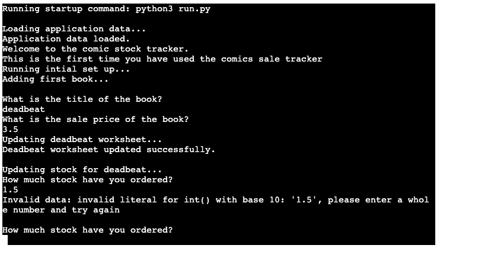

# **Testing** 

### **Note When Testing**
To test all functions, you may need to delete the data in the google sheet. To do this when the program prompts you to choose between stock or sales type "delete" all in lower case. 

It will then ask you to confirm your choice three times. Then it will clear the sheet. If it has been performed correctly it will look like this;

* [Validation](#Validation)
* [Functionality Testing](#functionality-testing)
    * [User Story Evaluation](#user-story-valuation)
* [Bug Fixes](#bug-fixes)
* [Known Bugs](#known-bugs)

## **Validation**
I ran my code through the [pep8online linter](http://pep8online.com/) to check for errors. The original code came back with the following errors;

These were fixed in commit [1ef6d64](https://github.com/John-McPherson/Python-Essentials-Portfolio-Project/commit/1ef6d6481bbeb06daed090ac80b0ed134fbbc72d#diff-d6af0459a37d985953d7040c14f53feb3b9cc9e58b543aa3c2b80256d276c5e0). After that the code passed through the linter with no further issues;

## **Functionality Testing**
* [User Story Evaluation](#user-story-valuation)
* [Additional User Stories](#additional-user-stories)
* [Manual Testing](#manual-testing)

### **User Story Evaluation**

Once development was complete I re-evaluated my user stories to ensure that I had met the project goals; 

#### As a user, I expect:
* To be able to easily understand what information the application is asking for. 

**The application uses simple language when asking for user input. And when a specific format is required (for example when inputting dates) that is indicated through a print statement**

**The application also uses data validation to ensure that the inputs are correct and uses error handling to help the user to know how to resolve any input errors**
* To be prompted to reorder stock when an item is running low.

**After updating sales the application checks to see if the stock levels for each book are less than 50 books. If they are it will prompt the user to place a reorder for the book**

* To get reports after each input showing both gross and net profit in an easy to understand manner. 

**After updating sales the information is presented to the user in an easy to understand format. This is then saved in the google sheet so that users can refer back to it.**

* To be able to easily update sales.

**On running the application, the user is asked if they are asked if they are updating stock or sales. If they choose sales the program prompts them for the information required.**

* To be able to easily update stock. 

**On running the application, the user is asked if they are asked if they are updating stock or sales. If they choose stock the program prompts them for the information required.**
 
#### As a user, I want:
* To be able to see the data I am to input to confirm it is correct.
**When updating a sale, the program shows the user their input and asks them to confirm it is correct before proceeding.**

* To be able to easily navigate through the data.

**The application updates a google sheet that presents the data in an easy to understand way. Summaries for sales and stock are easily accessible. And there is a further break down for convention sales**

**Each book has its own section which will display a more detailed breakdown of information.** 

* To be able to add additional books through the command line interface without having to manually modify the code or the spreadsheet.

**The stock update program has the option to add books to the spreadsheet. This function gets all the information required to run the program without requiring the user to have to update any spreadsheets manually** 

### **Additional User Stories**

During development it became clear that from a UX point of view that I needed to add the following user stories; 

#### As a user, I expect:

* To be able to clear the google sheet from within the application. 

**While testing the application it quickly became irritating to have to manually delete the data every time a new feature was added. To avoid this, I implemented a function to clear the sheet and start again.**

**To avoid this being accidently being called I made it a hidden function and made it so that the user would have to confirm that they wanted to delete the data three times before deleting the data**

**To access the function when the program asks the user to choose between stock or sales you type "delete" in lowercase.**

* If the program is run without any data it will run a set up function to ensure that all the functions run correctly. 

**After executing the delete function the next time the program runs it will run a set up function. This prevents the user from updating sales when there is nothing to update.**

### **Manual Testing**

After running the program through the linter, I manually checked to ensure that all functions and validation was working as intended. 

My initial run through revealed that the delete function was not adding the correct headings in the con sheet which was making the data difficult to parse. This was fixed in commit [0d61bf](https://github.com/John-McPherson/Python-Essentials-Portfolio-Project/commit/0d61bf9df038751700188dcce306495a8d868886#diff-d6af0459a37d985953d7040c14f53feb3b9cc9e58b543aa3c2b80256d276c5e0).

I then tested the confirm choice function and it was not working as intended. Instead of just rerunning the confirm choice function it would rerun the whole function that called it. That was fixed in commit [c0fa215](https://github.com/John-McPherson/Python-Essentials-Portfolio-Project/commit/c0fa215326292c33258c38d1db739cb7fb5240a3). 

I first checked the set-up function. It worked as intended. I then checked the initial data validation and that worked as intended;

I then tested the date validation process. And that worked as expected. 

I then checked the spreadsheet to check to see if the information pulled through and everything was working as intended. 

I then reran the program to see if everything worked as expected. I also tried to input a book with the same title to see if the data validation was working as intended. 

I then checked to see if the stock and sales function was working as intended. The data validation was working as expected. 

I then checked the online sales function and that worked as expected. 

I entered an input high enough to trigger the auto reorder function and that worked as expected. 

Then I checked the con-sales function and that was working as expected. 

I then checked the sheet to see if it had pulled through the information as intended and everything had worked okay. 

I then checked to see if stock limit I put in place was working. It was functioning as expected. 

Finally, I checked the delete function to see if that was working as intended. During testing I discovered that it would let you access the sales function but without any books it would throw up an error. 

This was fixed in commit [633bf1](https://github.com/John-McPherson/Python-Essentials-Portfolio-Project/commit/633bf145635bf83962da59f74fd3cf87e74219f2)

While fixing the delete function issues I discovered a new validation issue with some inputs that required integers rather than floats. This was fixed in commit [ee1c67](https://github.com/John-McPherson/Python-Essentials-Portfolio-Project/commit/ee1c6769879fb97fa0e2f3e933e36ca600d0e0ef).

## **Bug Fixes**

1. The wrong function was called to update the cost per unit whenever stock levels were updated. This was causing issues with the calculations and caused incorrect data to pushed to the google sheet. This was fixed in commit [e5b10f9](https://github.com/John-McPherson/Python-Essentials-Portfolio-Project/commit/e5b10f9722dc373dd86bb3937275b0badd991a95#diff-d6af0459a37d985953d7040c14f53feb3b9cc9e58b543aa3c2b80256d276c5e0).

2. The recalculate CPU function was returning its value as an unwieldy integer. I added a round function so that the data that it returned was more readable. Fixed in commit [d3e251](https://github.com/John-McPherson/Python-Essentials-Portfolio-Project/commit/d3e25141fd14017182a28fb1b292dd572850d3fc#diff-d6af0459a37d985953d7040c14f53feb3b9cc9e58b543aa3c2b80256d276c5e0).

3. The gross profit was being miscalculated. This was fixed in commit [877dd5](https://github.com/John-McPherson/Python-Essentials-Portfolio-Project/commit/877dd5ab14d9329f251e99daa778dead32e1952a#diff-d6af0459a37d985953d7040c14f53feb3b9cc9e58b543aa3c2b80256d276c5e0).

4. The program would crash whenever there was no data being provided to the update header function. This was fixed in commit [d48f68](https://github.com/John-McPherson/Python-Essentials-Portfolio-Project/commit/d48f68d2ca953a7a1b6d7500d15e52eb84b60953#diff-d6af0459a37d985953d7040c14f53feb3b9cc9e58b543aa3c2b80256d276c5e0).

5. The gross and net profit was being updated in the wrong section. This was fixed in commit [a45241](https://github.com/John-McPherson/Python-Essentials-Portfolio-Project/commit/a452412f3ea9cdcc13c0f462a13e0032b7e2e5ed#diff-d6af0459a37d985953d7040c14f53feb3b9cc9e58b543aa3c2b80256d276c5e0).

6. When reordering stock due to low stock levels the new data was being overwritten with the old code meaning the stock tracker was not working. This was fixed in commit [dda9e2](https://github.com/John-McPherson/Python-Essentials-Portfolio-Project/commit/dda9e260ea8d7564a28b1a7330e6475ca6c4b13b#diff-d6af0459a37d985953d7040c14f53feb3b9cc9e58b543aa3c2b80256d276c5e0), [d42bf4](https://github.com/John-McPherson/Python-Essentials-Portfolio-Project/commit/d42bf429a0e0bef0ca132a47ae3252a01fb905fd#diff-d6af0459a37d985953d7040c14f53feb3b9cc9e58b543aa3c2b80256d276c5e0), and [ 6be11a](https://github.com/John-McPherson/Python-Essentials-Portfolio-Project/commit/6be11a23482554e768d6f98d5e33b596d8f4ad46#diff-d6af0459a37d985953d7040c14f53feb3b9cc9e58b543aa3c2b80256d276c5e0)

7. The populate comic list was updating the price with the value of the original book. This was fixed in commit [a8decb](https://github.com/John-McPherson/Python-Essentials-Portfolio-Project/commit/a8decb26d14efc6fd7baacc71cc96229aa0d2828).

8. The populate comics list function was pulling the data from the wrong sheet. This was fixed in commit  [5f71f3](https://github.com/John-McPherson/Python-Essentials-Portfolio-Project/commit/5f71f3393348019ea18c6daf34327832221fc7ea#diff-d6af0459a37d985953d7040c14f53feb3b9cc9e58b543aa3c2b80256d276c5e0).

9. The validated function was transposing the day and the month causing correct inputs to not pass through the validation. This was fixed in commit [8a8eaa](https://github.com/John-McPherson/Python-Essentials-Portfolio-Project/commit/8a8eaa8a73e061017a6cc787d975102c9d1acfcb).

10. The select book function was not displaying the list of books to choose from. This was fixed in commit [560e88](https://github.com/John-McPherson/Python-Essentials-Portfolio-Project/commit/560e88290ae7864b0d3b6b3951e2ee109384cae8).

11. The confirm choice function was not working as intended. Instead of just rerunning the confirm choice function it would rerun the whole function that called it. That was fixed in commit [c0fa215](https://github.com/John-McPherson/Python-Essentials-Portfolio-Project/commit/c0fa215326292c33258c38d1db739cb7fb5240a3). 

12. If 0 is entered for price or stock it causes a divde by 0 error. This was fixed in commit [c0fa21](https://github.com/John-McPherson/Python-Essentials-Portfolio-Project/commit/c0fa215326292c33258c38d1db739cb7fb5240a3).

13. The delete content function was causing errors when it the run application again choice was made after deletion. This was fixed in commit [633bf1](https://github.com/John-McPherson/Python-Essentials-Portfolio-Project/commit/633bf145635bf83962da59f74fd3cf87e74219f2).

14. Some functions would cause the system to crash when the user inputted a float. This was fixed in commit [ee1c67](https://github.com/John-McPherson/Python-Essentials-Portfolio-Project/commit/ee1c6769879fb97fa0e2f3e933e36ca600d0e0ef).

15. If the user quit between the add book function and restock function when the application was run again it would throw up a divide by zero error and quit the application. This meant that the user would then have to manually delete the data from the google sheet to allow the application to work again. This was fixed in commit [338b5c](https://github.com/John-McPherson/Python-Essentials-Portfolio-Project/commit/338b5c80fdf19f0e45f36e857a9ebdfdc8fc67ba).

16. If stock ever got to negative numbers this would cause a fatal error and cause the application to crash when calculating a restock. This was fixed by preventing the user from entering sales higher than current stock levels would allow. Now whenever a user tries to enter sales numbers higher than stock levels it prompts the user to either order more stock or renter a lower sales number. This was fixed in commits [1c39ffe](https://github.com/John-McPherson/Python-Essentials-Portfolio-Project/commit/1c39ffe7514945f58357ed788bfb2b3f7229c7c9), [edcb4a0](https://github.com/John-McPherson/Python-Essentials-Portfolio-Project/commit/edcb4a0a7c31f19dcafd632b35b2f7cfbd13dcb6), [f808266](https://github.com/John-McPherson/Python-Essentials-Portfolio-Project/commit/f8082665438af61db66960da729ed0b42f45359d), [1f34750](https://github.com/John-McPherson/Python-Essentials-Portfolio-Project/commit/1f34750a45f7e48d1aef1c2c2822844a3041e784), [f8aacc8](https://github.com/John-McPherson/Python-Essentials-Portfolio-Project/commit/f8aacc8528579a10bf3337a91f6ed0864a6a7f8b), [12678c8](https://github.com/John-McPherson/Python-Essentials-Portfolio-Project/commit/12678c8f37de5845be09713d251862285638dc3b), [99a558e](https://github.com/John-McPherson/Python-Essentials-Portfolio-Project/commit/99a558e574fb5ddb3fc15856776591184a63397b).

17. The error handling in the update_stock function was not working correctly. This was fixed in commit [4322610](https://github.com/John-McPherson/Python-Essentials-Portfolio-Project/commit/4322610bf708dea51a12d9cd24ab25fd6b734ed8).

18. On first load the populate comic list would cause the application to crash as it was trying to get infomation on stock levels that had not been added yet. This was fixed in commit [cbf8a06](https://github.com/John-McPherson/Python-Essentials-Portfolio-Project/commit/cbf8a068aa6d05e3d4bee835d114425f611a7920)

## **Known Bugs**

1. When updating stock levels due to the way numbers are rounded when generating the CPU (cost per unit) per book if the stock ordered is more than 100 times higher than the cost of the restock it will generate a CPU of £0.0. As no real world data would have a such a low cost compared to the stock ordered the impact of this bug is considered low. 

